# Tournament Architecture

本文基于 [tournament-technical-plan.md](./tournament-technical-plan.md) 绘制赛事系统架构图。它用于实现前快速对齐边界、模块、数据关系、权限和核心流程；细节规则仍以技术方案为准。

## 1. 系统上下文

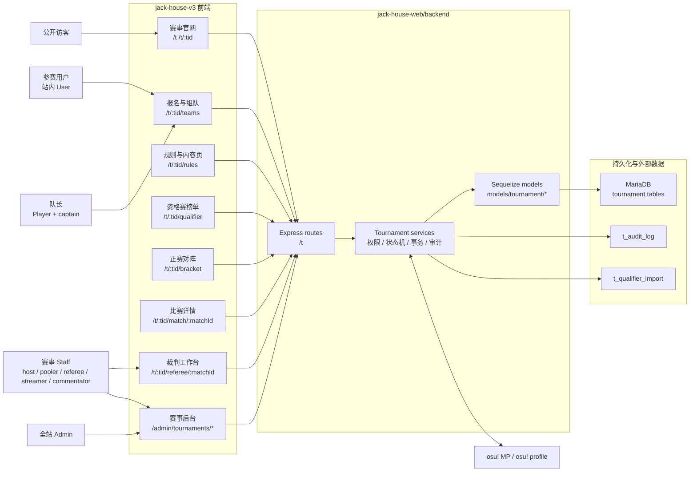

## 2. 前后端分层

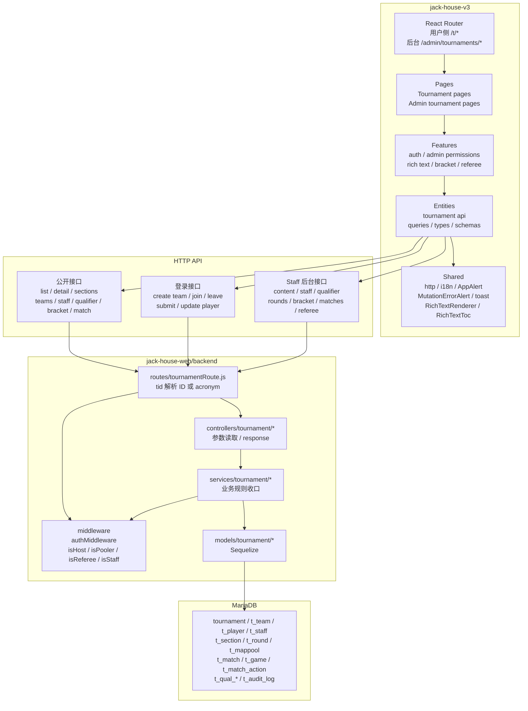

## 3. 后端服务拆分

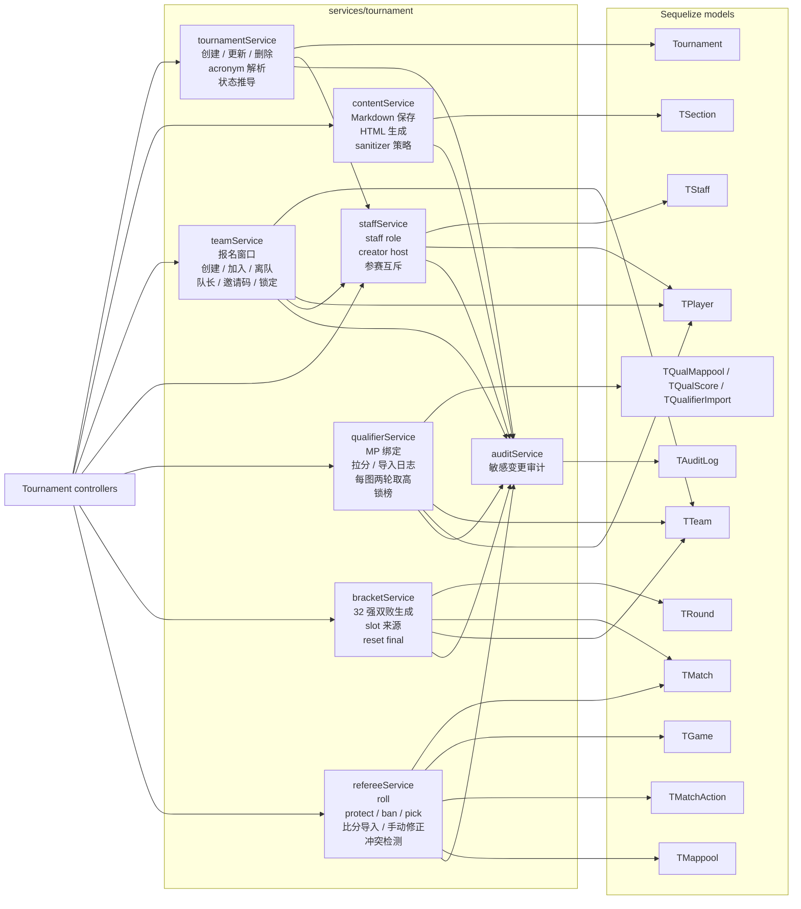

## 4. 领域数据模型

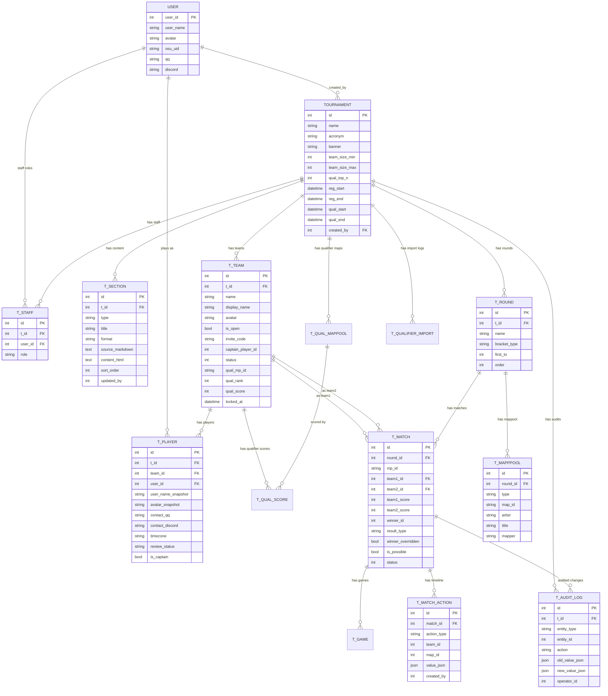

## 5. 权限与角色边界

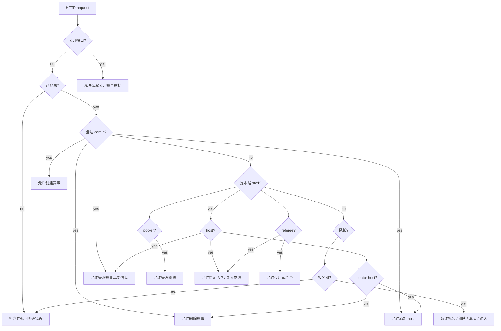

## 6. 用户侧路由与页面结构

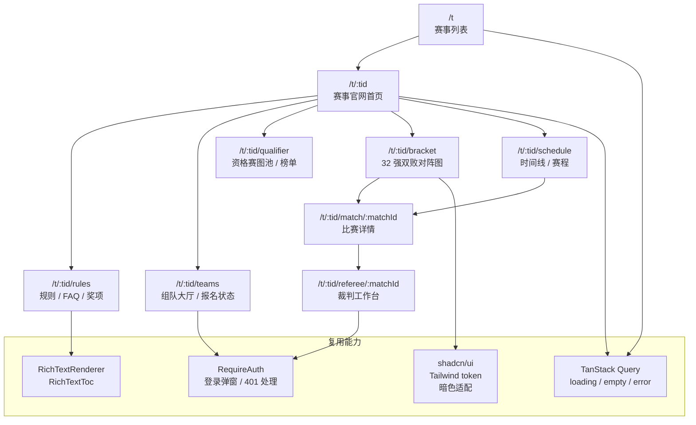

## 7. 后台路由与管理面

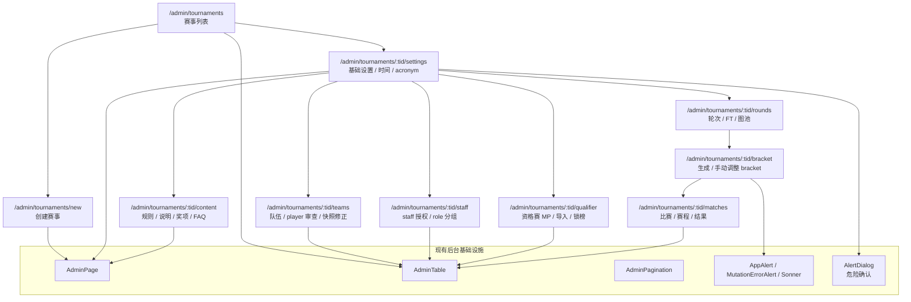

## 8. 报名与组队流程

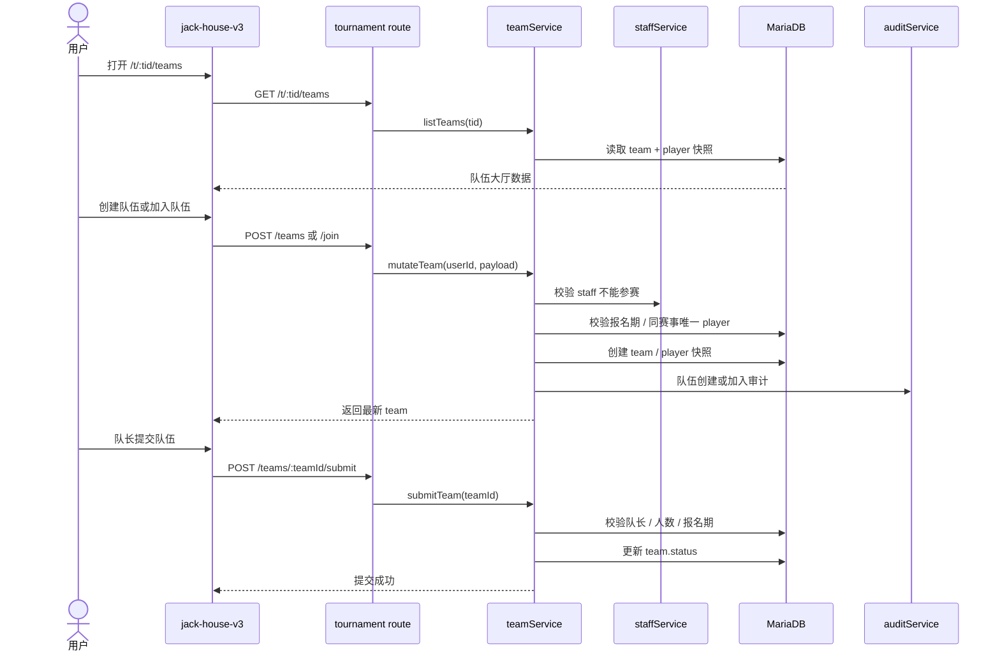

## 9. 内容发布流程

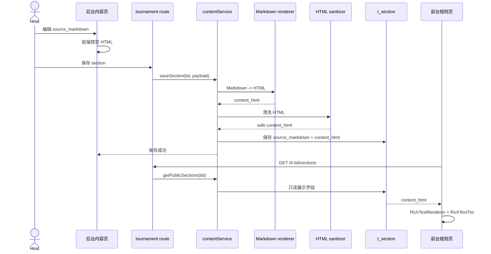

## 10. 资格赛流程

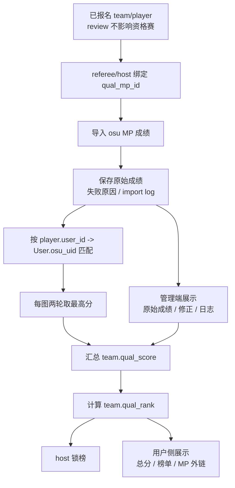

## 11. 32 强双败正赛生成

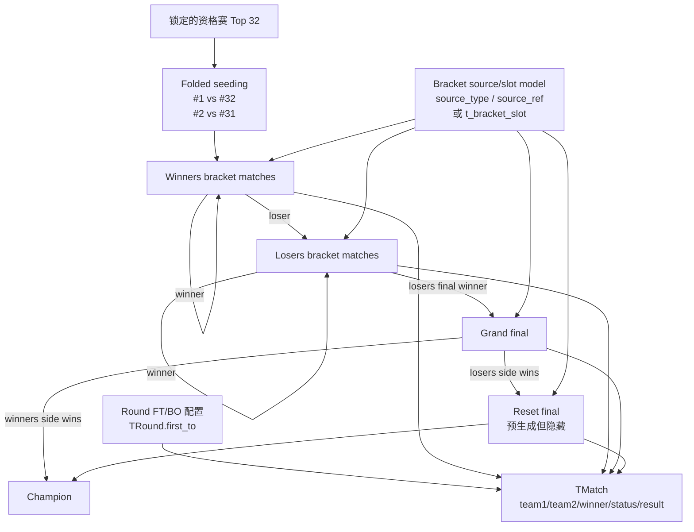

## 12. 裁判工作台状态机

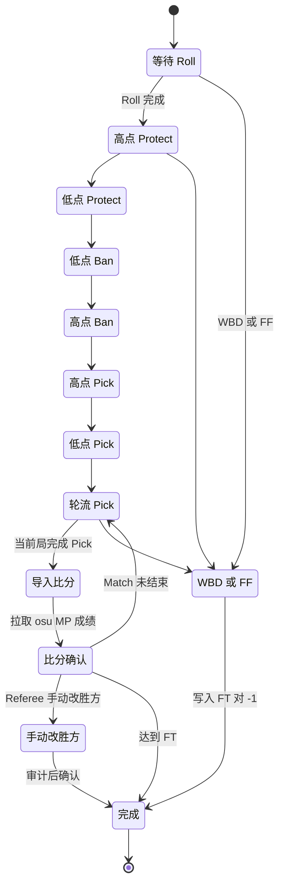

## 13. 裁判台数据流

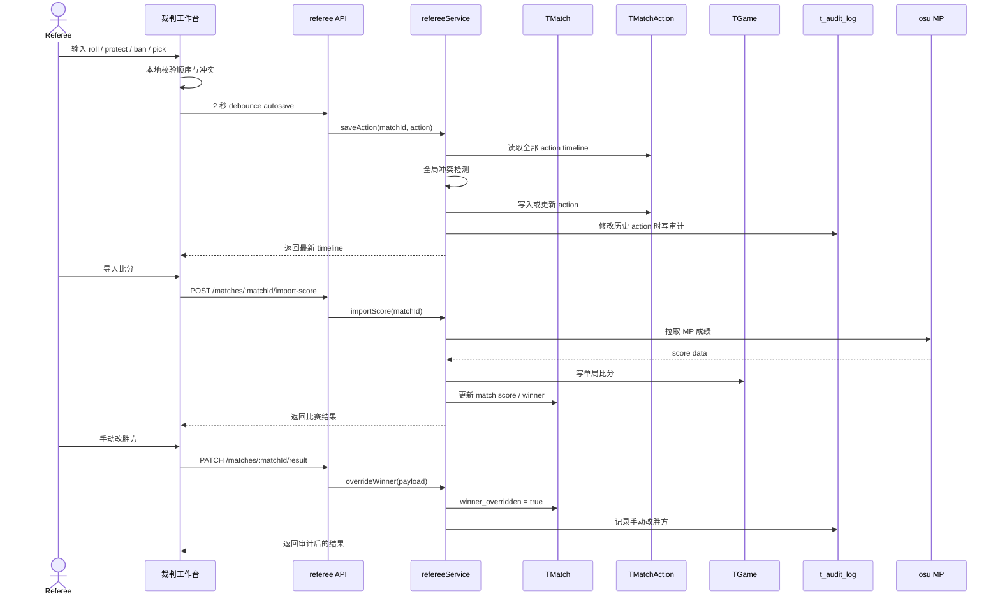

## 14. 审计触发点

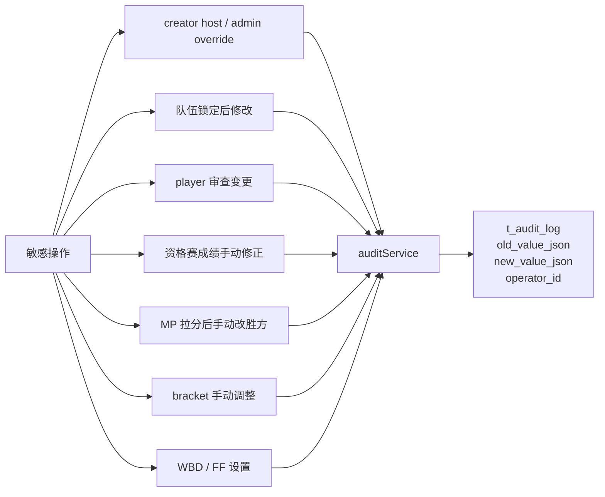

## 15. 数据迁移顺序

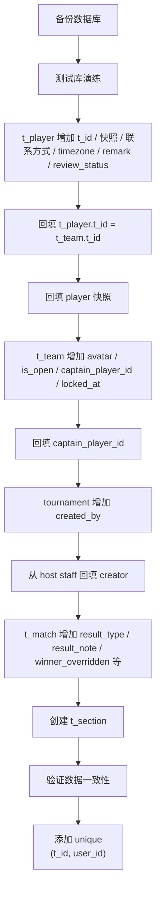

## 16. 实施依赖图

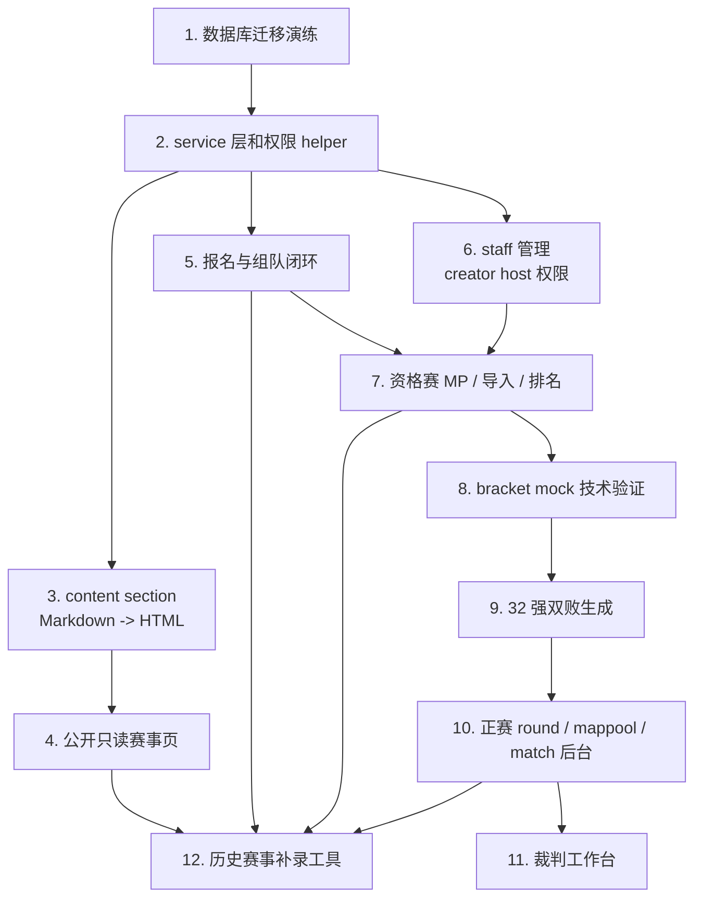

## 17. 实现检查矩阵

| 区域 | 核心产物 | 必须验证 |
| --- | --- | --- |
| 数据库 | 迁移 SQL、回填脚本、约束 | 测试库演练、可回滚、旧数据可读 |
| 后端 service | tournament/team/staff/content/qualifier/bracket/referee/audit | 业务规则不散落 controller |
| 权限 | creator host、host、pooler、referee、staff、admin | 删除赛事、添加 host、staff 参赛互斥、报名窗口 |
| 内容 | `t_section`、Markdown 保存、HTML 缓存 | 前台只读 HTML，渲染走 `RichTextRenderer` |
| 报名 | team/player 快照、公开/私密队伍、邀请码 | 同赛事唯一 player、队伍锁定限制 |
| 资格赛 | MP 绑定、导入日志、两轮取高、锁榜 | 用户侧不展示两轮原始成绩 |
| 正赛 | 32 强双败、slot/source、GF reset | folded seeding、隐藏 reset final |
| 裁判台 | action timeline、autosave、冲突检测 | 无 websocket、无 undo、历史修改冲突禁止保存 |
| 审计 | `t_audit_log` | 敏感变更记录 old/new/operator |
| 前端 | 用户侧官网、后台管理、bracket、裁判台 | 移动端、暗色主题、loading/empty/error |
