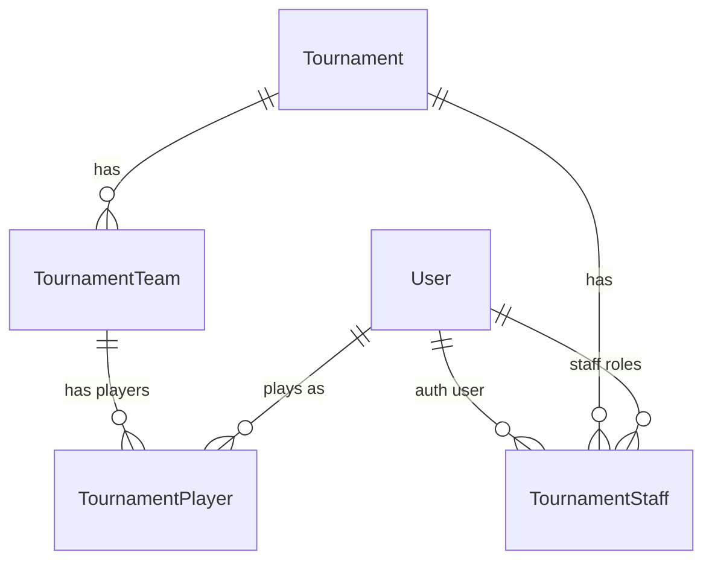

# Tournament System

赛事系统是迁移 MVP 之后的独立大型任务。它不按旧接口逐页补齐，而是先确认领域模型、权限、报名、资格赛、正赛和裁判工作流，再进入实现。

## 仓库边界

- 前端：`/Users/bytedance/jackhouse/jack-house-v3`
- 后端：`/Users/bytedance/jackhouse/jack-house-web/backend`
- 旧前端：`/Users/bytedance/jackhouse/jack-house-web/frontend`，只作为业务和视觉参考。

赛事相关旧后端代码集中在：

- `routes/tournamentRoute.js`
- `controllers/tournament/*`
- `models/tournament/*`
- `middleware/tournamentAuth.js`

## 系统定位

- `event` 是站内活动/排行活动，已迁移到 `/event/:eventId`。
- `tournament` 是完整赛事生命周期，包含官网展示、报名、队伍、staff、图池、资格赛、正赛、裁判、赛程和结果沉淀。
- 两者可以复用头像、用户链接、排行榜 UI、富文本 renderer、上传策略，但领域模型不要混用。

赛事按“届”建模。即使 JHC2026 和 JHC2027 属于同一系列，也作为两个独立 `Tournament`，因为规则、图池、报名和 staff 都可能不同。

## 当前后端库存

旧后端已有可用原型：

- `Tournament`：名称、acronym、简介/规则、banner、队伍人数、时间段、状态。
- `TTeam`：队伍、队长、审核状态、资格赛 MP、资格赛排名/分数。
- `TPlayer`：队员，引用全站 `User.user_id`。
- `TStaff`：赛事 staff，引用全站 `User.user_id`，已有 `(t_id, user_id, role)` 多角色结构。
- `TQualMappool` / `TQualScore`：资格赛图池和成绩。
- `TRound` / `TMappool` / `TMatch` / `TGame`：正赛轮次、图池、比赛和单局/操作记录。

主要问题：

- `TPlayer` 缺少报名时快照字段，历史展示会受用户改名/换头像影响。
- `TGame` 同时承担实际对局和 ban/protect/pick 操作，裁判时间线语义混杂。
- `TMatch` 缺少 bracket slot、上下游 match、败者组流转、WBD/FF 等结构。
- 资格赛成绩只汇总到 `TTeam.qual_rank/qual_score`，缺少导入日志、原始成绩和锁榜快照。
- `Tournament` 内容能力偏少，缺规则章节、公告、时间线、奖项、直播/资源链接等官网内容。

## Tournament 本体

已确认：

- `acronym` 可作为公开 URL：`/t/JHC2026`。
- host 可以修改 acronym；修改后旧 acronym 失效，不做历史 alias。
- 赛事状态应主要由时间自动推导，例如报名中、资格赛中、正赛中、已结束。
- host 可以在非当前时间状态下管理和修正数据，前台用户权限仍按实际时间窗口限制。
- 赛事规则、说明、公告、时间线等内容放在 tournament 自己的表里，不依赖 forum/post。
- 创建赛事需要全站 admin 权限，不单独设计赛事内管理员角色。
- 创建者自动成为 creator host。
- 只有 creator host 可以删除赛事和添加其他 host；普通 host 不拥有这两个权限。

建议字段：

`Tournament`

- `id`
- `name`
- `acronym`
- `banner`
- `team_size_min`
- `team_size_max`
- `qualifier_slots`
- `registration_start_at`
- `registration_end_at`
- `qualifier_start_at`
- `qualifier_end_at`
- `main_stage_start_at`
- `main_stage_end_at`
- `archived_at`
- `created_by`
- `created_time`
- `updated_time`

内容表建议：

- `TournamentSection`：规则、说明、奖项、FAQ 等。赛事规则优先支持 Markdown source，展示层统一走渲染后的 HTML + `RichTextRenderer`，规则页同时接 `RichTextToc` 生成目录。
- `TournamentAnnouncement`：赛事公告。
- `TournamentScheduleItem`：关键时间线。
- `TournamentResourceLink`：直播、社群、表格、外部链接等。

赛事规则内容策略：

- 不把规则写进 forum/post。
- 赛事规则主入口支持直接粘贴/编辑 Markdown，方便迁移 osu 侧规则文档。
- 不要求基于 Tiptap 富文本编辑器重写规则文档。
- 保存时保留 Markdown 原文，同时生成 HTML 作为前台渲染产物。
- 前台 `/t/:tid/rules` 使用 `RichTextRenderer` 渲染生成后的 HTML，右侧或页面内目录使用 `RichTextToc`。
- Tiptap 仍可用于赛事说明、公告、FAQ 等更偏官网展示的富文本内容，也可以作为规则的可选富文本模式，但不是赛事规则的唯一入口。
- 不做 Markdown 和 Tiptap 富文本的无损双向切换承诺；Markdown source 是规则文档的主数据，HTML 是展示缓存。

`TournamentSection` 建议字段：

- `id`
- `tournament_id`
- `type`，如 `rules` / `description` / `prize` / `faq`
- `title`
- `format`，如 `markdown` / `html`
- `source_markdown`
- `content_html`
- `sort_order`
- `updated_by`
- `created_time`
- `updated_time`

## 身份模型

推荐模型：`User` 是账号源，`TournamentTeam` 是参赛单元，`TournamentPlayer/TPlayer` 是队伍成员快照。

已确认：

- 参赛、staff、裁判都必须关联站内 `User`。
- 不另起一套赛事账号系统。
- `Player` 表示“某个 user 在某支赛事队伍里的参赛成员身份”，不是独立账号。
- 同一个 `user_id` 可以在 `Player` 表出现多次，但必须属于不同 `team_id`。
- 同一个 tournament 中同一个 user 只能有一个有效 player。
- 报名期内允许退出当前 team 再加入其他 team；普通退队/换队可以删除旧 player 记录。
- 单人赛也统一创建 team。
- 本模型下有有效 team/player 即视为报名，不另加 registration 表。
- 不支持外部嘉宾或非站内 staff/player 作为正式身份。历史赛事补录如果遇到当年选手不是站内用户，建议由后台导入流程创建“占位/导入用 User”，写入 osu_uid、user_name、avatar 等基础资料，再创建 player。这样能保留 `User -> Player` 主关系，避免 tournament 里出现第二套身份系统。

历史赛事补录建议：

- `User` 可以预留 `is_imported` / `import_source` 字段，或先通过固定密码为空、特殊 status/role 约定为导入用户。
- 导入用户不需要能登录；如果本人未来注册/绑定，可以再做账号合并或认领流程。
- 补录 player 仍写 `user_name_snapshot`，保证历史展示稳定。
- 补录数据应标记 import batch，便于后续回滚和审计。

直接升级旧 `TPlayer`，不新建并行的 `TournamentPlayer`。旧表的核心关系是对的，先补字段、约束和 service 层校验，避免同时维护两套 player 概念。

`TPlayer` 建议字段：

- `id`
- `team_id`
- `user_id`
- `tournament_id`，旧后端实际字段名建议沿用 `t_id`
- `user_name_snapshot`
- `avatar_snapshot`
- `contact_qq`
- `contact_discord`
- `timezone`
- `remark`
- `team_role`
- `status`
- `created_time`
- `updated_time`

快照策略：

- 创建/加入队伍时从 `User` 复制用户名、头像、QQ、Discord。
- player 不保存 `osu_uid_snapshot`。`User.user_id` 和 `User.osu_uid` 一一对应且 `osu_uid` 不可改变，成绩拉取直接通过 `player.user_id -> User.osu_uid`。
- 历史展示优先使用 player 快照，点击仍跳转当前站内用户页。
- 公开历史页面、队伍页、成绩页、bracket 默认展示 `user_name_snapshot` / `avatar_snapshot`。
- 当前报名管理后台同时展示 player 快照和当前 `User`，方便 host 识别改名、头像变化或导入用户。
- player 没有单独展示名，公开名称直接使用报名时的 `user_name_snapshot`。
- 联系方式可以在本届赛事中单独修改，不回写 `User`。
- `TPlayer` 推荐冗余 `tournament_id`，旧后端实际字段名可沿用 `t_id`。这会轻微违反完全规范化，但在 MariaDB + Sequelize 下可以更直接地做 `(tournament_id, user_id)` 有效成员唯一校验，也能减少常见查询必须 join team 的成本。写入时由 service 保证 `player.tournament_id === team.tournament_id`。
- 不提供用户手动刷新快照入口；如果报名后确实需要修正用户名、头像、联系方式、timezone 或备注，由 host 后台修改并写 audit log。

## Team

已确认：

- 队伍由队长提交信息。
- 队伍人数支持 1-2 人，保留 `team_size_min/max` 字段。
- 队伍需要 avatar 字段，第一版可以只预留，不做完整上传逻辑。
- 队长可以重置邀请码。
- 支持私密队伍和公开队伍两种组队方式，两种都在组队大厅展示。
- 私密队伍需要邀请码加入；公开队伍不需要邀请码，所有符合报名条件的用户都可以直接加入。
- 队长可踢队员，队员可退出队伍，但仅限报名期。
- 队伍通过后信息锁定，普通用户不能换人或改队伍信息；host 可以后台修正。
- 队伍锁定后 player 自己也不能修改联系方式、timezone 或备注；只有 host 可以后台修正。
- 没有“队伍被拒绝”状态。赛事官方审查针对 player，而不是 team。
- 资格赛只要求已报名即可参加，player 审查结果不影响资格赛。
- 正赛资格由 player 审查结果影响：
  - 1 人队伍中该选手未通过审查，则队伍不能参加正赛。
  - 2 人队伍中一人未通过审查，另一人可以继续单独参赛；系统不需要自动踢出未通过者。

建议字段：

`TournamentTeam`

- `id`
- `tournament_id`
- `name`
- `display_name`
- `avatar`
- `invite_code`
- `is_open`
- `captain_player_id`
- `status`
- `qual_mp_id`
- `qual_rank`
- `qual_score`
- `locked_at`
- `created_time`
- `updated_time`

队伍状态建议：

- `created`：队伍已创建，报名期内可改。
- `submitted`：队长已提交队伍信息。
- `approved`：队伍信息通过，锁定普通修改。
- `locked`：赛事阶段锁定，不允许普通成员变更。

Player 审查状态建议：

- `active`：正常。
- `review_pending`：等待官方审查。
- `review_passed`：通过，可参加正赛。
- `review_failed`：未通过，不能参加正赛。
- `removed`：历史保留用；报名期普通退队可直接删除记录。

用户侧不公开标红或强调 `review_failed`。该状态只影响正赛资格，具体审查状态主要在后台展示。

队长建议使用 `captain_player_id` 指向队内 player。队长就是创建队伍的人；旧后端如保留 `captain_id=user_id`，可以短期兼容或作为派生字段，但长期逻辑以 `captain_player_id` 为准。

## Staff

已确认角色：

- `host`
- `pooler`
- `referee`
- `streamer`
- `commentator`

已确认规则：

- 创建赛事的人自动成为 creator host，并拥有添加其他 host 的权利。
- 可以有多个 host。
- 用户侧不展示“最高 host”概念，所有 host 列在一起。
- host 给站内已存在 user 授予 staff role。
- 一个人可以有多个 staff role，多 role 就多行记录。
- 同一个人有多个 role 时，在每个 role 展示区都出现一次。
- 只有 staff 才能看到赛事后台；不存在隐藏后台协作人员。
- 所有 staff 都公开展示，并按 role 分组。
- 第一版默认所有 staff 都不允许参赛，降低权限和利益冲突复杂度。
- 后续如果允许某些 role 参赛，再通过 role policy 精细化开放。

`TournamentStaff`

- `id`
- `tournament_id`
- `user_id`
- `role`
- `display_name`
- `public_role`
- `sort_order`
- `created_time`

约束：

- `(tournament_id, user_id, role)` 唯一。
- 全站 admin 可作为 emergency override，但不自动出现在 staff 列表。

## 权限基线

所有写操作必须由后端校验，前端隐藏按钮只是体验优化。

| 能力 | 游客 | 登录用户 | 参赛者 | 队长 | host | pooler | referee | 全站 admin |
| --- | --- | --- | --- | --- | --- | --- | --- | --- |
| 查看公开赛事 | 是 | 是 | 是 | 是 | 是 | 是 | 是 | 是 |
| 创建赛事 | 否 | 否 | 否 | 否 | 否 | 否 | 否 | 是 |
| 修改赛事基础信息 | 否 | 否 | 否 | 否 | 是 | 否 | 否 | 是 |
| 删除赛事/添加 host | 否 | 否 | 否 | 否 | 仅 creator host | 否 | 否 | 是 |
| 管理赛事内容/公告/时间线 | 否 | 否 | 否 | 否 | 是 | 否 | 否 | 是 |
| 创建/加入队伍 | 否 | 是 | 否 | 否 | 否 | 否 | 否 | 可作为普通用户 |
| 修改自己的 player 信息 | 否 | 是 | 是 | 是 | 否 | 否 | 否 | 可作为普通用户 |
| 管理本队成员/邀请码 | 否 | 否 | 否 | 是 | 否 | 否 | 否 | 否 |
| 审查 player / 修正队伍 | 否 | 否 | 否 | 否 | 是 | 否 | 否 | 是 |
| 管理 staff | 否 | 否 | 否 | 否 | 是 | 否 | 否 | 是 |
| 管理资格赛图池 | 否 | 否 | 否 | 否 | 是 | 是 | 否 | 是 |
| 拉取/修正资格赛成绩 | 否 | 否 | 否 | 否 | 是 | 否 | 是 | 是 |
| 计算/锁定资格赛排名 | 否 | 否 | 否 | 否 | 是 | 否 | 视授权 | 是 |
| 生成/调整 bracket | 否 | 否 | 否 | 否 | 是 | 否 | 否 | 是 |
| 管理比赛排期/MP | 否 | 否 | 否 | 否 | 是 | 否 | 是 | 是 |
| 使用裁判工作台 | 否 | 否 | 否 | 否 | 是 | 否 | 是 | 是 |

需要审计的操作：

- host override。
- 全站 admin override。
- 队伍锁定后修改。
- player 审查状态变更。
- 成绩手动修正。
- osu MP 分数导入后手动修改胜方。
- bracket 手动调整。
- 正赛 WBD/FF 设置。

## 报名流程

1. 用户进入赛事页，系统检查登录状态、osu 绑定状态、报名时间窗口。
2. 队长创建 team，填写队伍信息，系统为队长创建 player 快照。
3. 队长选择私密队伍或公开队伍。私密队伍通过邀请码加入；公开队伍不需要邀请码，可从组队大厅直接加入。
4. 队长提交队伍信息。
5. host 审查 player，队伍信息通过后锁定。
6. 报名结束或赛事进入后续阶段后，普通用户不能创建、加入、退出、踢人或换队。
7. 特殊情况由 host 或全站 admin 后台修正，并写 audit log。

## 资格赛

已确认：

- 资格赛和正赛都是每队一人上场。
- 资格赛图池固定为 stage 1-7，不需要 type/mod 信息。
- 每个队伍的资格赛只绑定一个 osu MP。
- referee/host 填写或更新该队伍的 qualifier MP ID。
- 队长不能提交 qualifier MP ID。
- 队伍可以在同一个 MP 中把资格赛图池打两轮。
- 第二轮可以不打，也可以只重打部分图。
- 资格赛每张图取两轮中的最高分，总分为每张图最高分相加。
- 拉取成绩的常规权限仅 referee 和 host。
- 手动录入/修正只作为异常处理，必须审计。

建议结构：

`TournamentQualifierMap`

- `id`
- `tournament_id`
- `stage`，固定 1-7
- `beatmap_id`
- `beatmapset_id`
- `title`
- `artist`
- `creator`
- `version`
- `order`

`TournamentQualifierImport`

- `id`
- `tournament_id`
- `team_id`
- `mp_id`
- `status`
- `imported_by`
- `message`
- `created_time`

`TournamentQualifierScore`

- `id`
- `tournament_id`
- `team_id`
- `player_id`
- `map_id`
- `attempt_no`
- `score`
- `source_mp_id`
- `source_game_id`
- `import_id`
- `is_manual`
- `created_time`

`TournamentQualifierRanking`

- `id`
- `tournament_id`
- `team_id`
- `rank`
- `total_score`
- `detail_json`
- `is_locked`
- `calculated_by`
- `calculated_time`

公开展示建议：

- 榜单展示最终总分、排名、晋级标识。
- 站内不需要公开两轮原始成绩详情。
- 站内只列出 qualifier 对局、比分/总分和 osu MP 外链，用户需要细节时跳转到 osu MP 查看。
- 管理端展示 import log、失败原因、原始成绩、手动修正记录。

## 正赛与 Bracket

已确认：

- 第一版只支持双败制。
- 第一版固定 32 强 bracket。
- 正赛采用 folded seeding：资格赛 #1 vs #32、#2 vs #31，以此类推。
- 正赛所有轮次和对局双方应尽量由 bracket 规则和上一轮结果自动推导。
- 网站需要画出完整对阵图，这是正赛前端的主要难点之一。
- 双败需要支持 grand final reset：败者组冠军赢下第一场 GF 后，需要再打一场 reset final。reset final 在 bracket 数据中预生成但隐藏；旧模型中的 `is_possible` 可作为 GF(P) / reset final 标记继续沿用。
- 每场比赛都是两队 PK。
- 支持 WBD：win by default，由 referee/host 设置。
- 支持 FF：forfeit，例如超出等待时间未到，由 referee/host 设置。
- WBD/FF 不需要细分原因枚举，只保留备注字段。
- WBD 优先级高于普通比分。设置某一方 WBD 时，默认把 WBD 方比分设为该 round 的获胜所需分数，另一方比分设为 `-1`，例如 FT7 记为 `7:-1`。
- 从 osu MP 拉取比分后，胜方默认按分数自动判定；referee 可以手动修改胜方，但必须给出提醒并记录审计。
- 每场正赛只绑定一个 osu MP。
- MP ID 可以修改，处理填错等情况；同一场比赛不保存多个 MP。
- 比赛时间由 host/referee 后台填写。时间讨论和约战安排在外部社交媒体完成，网站不做约战系统。

建议结构：

`TournamentRound`

- `id`
- `tournament_id`
- `name`
- `stage`
- `order`
- `best_of`
- `start_at`
- `end_at`

每个 round 的 BO/FT 固定配置在 round 上，不做单个 match override。

`TournamentMappool`

- `id`
- `tournament_id`
- `round_id`
- `type`，首期固定为 `FU` / `DS` / `MD` / `LT` / `AC` / `QS` / `MN` / `RM` / `MX` / `DF` / `TB`
- `order`
- `beatmap_id`
- `beatmapset_id`
- `title`
- `artist`
- `creator`
- `version`

`TournamentBracketSlot`

- `id`
- `tournament_id`
- `round_id`
- `slot`
- `seed`
- `source_type`
- `source_ref`

`TournamentMatch`

- `id`
- `tournament_id`
- `round_id`
- `slot`
- `team1_id`
- `team2_id`
- `scheduled_at`
- `mp_id`
- `status`
- `team1_score`
- `team2_score`
- `winner_team_id`
- `result_type`，如 `normal` / `wbd` / `ff`
- `result_note`
- `is_completed` 或旧字段 `status`，只需要区分未开始和完成
- `mp_url` 可由 `mp_id` 拼接，不建议额外存储

`TournamentGame`

- 实际打过的一局。
- 记录 map、双方上场选手、分数、胜方、osu MP game id。

`TournamentMatchAction`

- 裁判操作时间线，不再混入 `TournamentGame`。
- 记录 roll、protect、ban、pick、score_import、score_edit、timeout、note 等。

## 裁判工作台

裁判工作台是独立工作流，不是比赛详情页加几个按钮。

应展示：

- 比赛基础信息：轮次、BO/FT、时间、MP、双方队伍。
- 双方队员、osu UID、邀请命令。
- 图池状态：可选、已 protect、已 ban、已 pick。
- 操作时间线。
- 当前比分和胜利条件。
- 异常提示：MP 未设置、未绑定 osu、图不在图池、成绩不完整。

已确认的操作顺序：

1. 双方 roll 点。
2. 点数高的一方先 protect 一张图。
3. 点数低的一方再 protect 一张图。
4. 被 protect 的图不能被另一方 protect，也不能在本场被 ban。
5. 点数低的一方先 ban 一张图。
6. 点数高的一方再 ban 一张图。
7. 点数高的一方先 pick。
8. 点数低的一方下一手 pick。
9. 后续双方轮流 pick。

例子：A 队 roll 67，B 队 roll 55，则 A protect、B protect、B ban、A ban、A pick、B pick，之后轮流。

保存策略：

- 不需要实时多人同步。
- 裁判做出修改后，前端 2 秒 debounce 自动保存。
- 其他用户刷新后获取新数据。
- 不需要 undo。裁判选错 ban/pick/protect 时，直接修改该操作对应的图即可。
- 裁判可以修改任意历史 ban/pick/protect。
- 修改时必须做冲突检测并提示：本局已 protect 的图不能 ban；已 ban 的图不能 pick；已 pick 的图不能再次 pick；同一队/双方不能重复执行同一限制动作。
- 如果修改历史操作会导致后续步骤冲突，禁止保存，要求裁判先把冲突步骤调整到合法状态。

## Bracket 展示调研

双败制常见结构是 winners bracket 和 losers bracket 分区，胜者在上半区继续推进，败者掉入下半区；losers bracket 的最终胜者再进入 grand final，必要时还有 bracket reset final。32 强固定后，比赛数量和上下游关系可以预生成，前端只负责渲染和状态展示。

调研结论：

- “横向树”通常指从左到右推进的 bracket，每轮是一个纵向列，连线表示晋级关系。
- “上下半区/败者组分区图”是双败最常见的横向树变体：上方 winners bracket，下方 losers bracket，中间或右侧接 grand final。
- 对 JHC 第一版，推荐采用上下分区的双败图，而不是把 winners/losers 混在一张复杂网状图里。
- 优先评估 `@g-loot/react-tournament-brackets`：它支持 single/double elimination，提供 `DoubleEliminationBracket`、`SVGViewer`、自定义 match component、upper/lower 数据结构和 SVG 缩放拖拽能力。
- 32 强双败图很宽，移动端和小屏必须支持横向滚动、缩放或 minimap。不要强行压缩到单屏。
- 如果现成库在样式、连线、移动端或数据结构上不合适，再自研 SVG/canvas 布局；但第一轮不建议直接自研。

参考：

- https://en.wikipedia.org/wiki/Double-elimination_tournament
- https://github.com/g-loot/react-tournament-brackets

## 前端信息架构

用户侧要像赛事官网，不做成后台表格页：

- `/t`：赛事列表，当前/即将开始/已结束。
- `/t/:tid`：赛事首页，banner、状态、报名 CTA、阶段入口、关键时间线、公告、staff。
- `/t/:tid/rules`：规则页，富文本和目录。
- `/t/:tid/teams`：队伍列表、报名/加入队伍入口、open team 列表。
- `/t/:tid/qualifier`：资格赛图池、成绩、排名。
- `/t/:tid/bracket`：正赛对阵。
- `/t/:tid/schedule`：赛程。
- `/t/:tid/match/:matchId`：比赛详情。
- `/t/:tid/referee/:matchId`：裁判工作台，仅 referee/host 可进。

后台侧保持高密度工具：

- `/admin/tournaments`：赛事列表。
- `/admin/tournaments/new`：创建赛事，全站 admin 可见。
- `/admin/tournaments/:tid/settings`：基础信息、时间、banner、acronym。
- `/admin/tournaments/:tid/content`：规则、说明、公告、时间线。
- `/admin/tournaments/:tid/teams`：队伍和 player 审查。
- `/admin/tournaments/:tid/staff`：staff 和权限。
- `/admin/tournaments/:tid/qualifier`：资格赛图池、MP、成绩拉取、排名、锁榜。
- `/admin/tournaments/:tid/rounds`：正赛轮次和图池。
- `/admin/tournaments/:tid/bracket`：对阵生成和必要修正。
- `/admin/tournaments/:tid/matches`：比赛排期、MP、比分、WBD/FF、完成状态。

## 实施阶段

### Phase 0: 详细设计

- 确认表结构和旧表改造方式。
- 确认 role policy 和审计日志边界。
- 确认双败 bracket 生成和推进规则。
- 调研并验证 bracket 渲染库，重点看 32 强双败、移动端、主题适配和自定义 match 卡片。

### Phase 1: 公开只读官网

- 实现 `/t`、`/t/:tid`、rules、teams、staff、qualifier、bracket 只读展示。
- 后端可先复用当前 read API，但 response 要收敛成稳定 DTO。

### Phase 2: 报名与队伍闭环

- 创建队伍、加入队伍、退出队伍、open team、邀请码重置。
- 报名前检查登录和 osu 绑定。
- player 快照写入和联系方式编辑。
- 队伍提交与锁定。
- 旧 `TPlayer` 表补 `tournament_id`、快照、timezone、remark、review status。

### Phase 3: 后台配置与审查

- 赛事基础配置。
- 内容块/规则/公告/时间线。
- staff 管理。
- player 审查和 host override。

### Phase 4: 资格赛成绩

- 资格赛图池 stage 1-7。
- MP ID 录入和 osu API 拉取。
- import log、原始成绩、手动修正。
- 每图两轮取高，总分计算，排名锁定。
- 用户侧展示 MP 外链，不公开站内原始成绩详情。

### Phase 5: 正赛与裁判工作台

- 双败 bracket 生成与推进。
- 32 强对阵图绘制。
- 比赛排期、单 MP、WBD/FF。
- 裁判工作台：roll、protect、ban、pick、score import、autosave、直接修改错误操作。
- 正赛 mappool 支持 `FU` / `DS` / `MD` / `LT` / `AC` / `QS` / `MN` / `RM` / `MX` / `DF` / `TB` 分类。
- `TournamentGame` 与 `TournamentMatchAction` 逐步拆分。

## 后端改造建议

短期：

- 保留现有 `/tournament` 路由作为基础。
- 为接口补统一错误响应和参数校验。
- 为 `TStaff`、`TTeam`、`TPlayer` 补 include 和权限边界。
- 不急着把所有表改名，先用 service 层隔离业务逻辑。

中期：

- 引入 tournament service，controller 不直接写复杂业务。
- 为 `TPlayer` 增加快照、timezone、remark、review status。
- 增加 tournament content/schedule/announcement。
- 增加 audit log。
- 拆分 `TGame` 与裁判 action log。

长期：

- 如果赛事系统成为核心模块，再考虑更严格的 migration 管理和接口 schema。
- 后端 TS 化不是前置条件，但赛事系统这种复杂模块会明显受益于类型和 schema。
